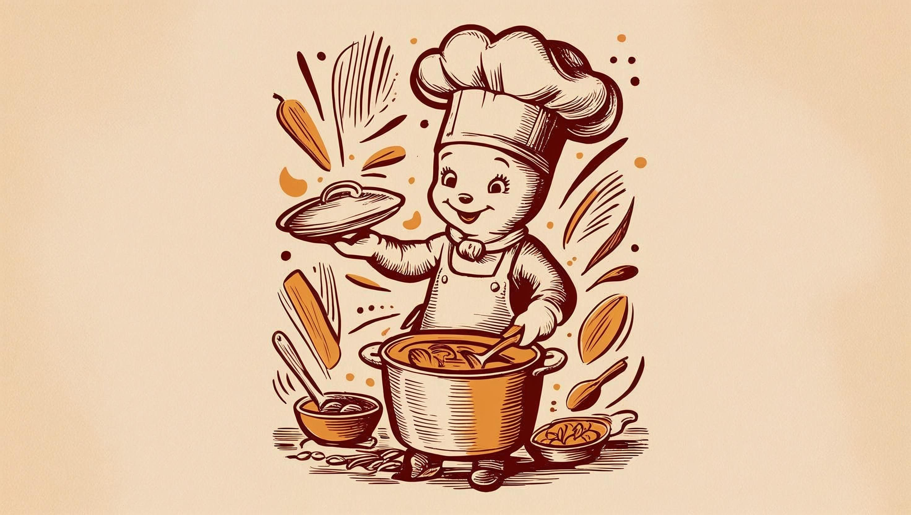

Over the last few weeks, I’ve been working on **Cooking Mate**, a full-stack MERN (MongoDB, Express, React, Node.js) web app that helps users manage their recipes — from searching and saving to organizing them in one place.

---

### 🍳 Features

- **Search Recipes**: Users can fetch new recipes using an API.
- **Save Recipes**: Users can add their favorites to a MongoDB database.
- **Delete Recipes**: Built-in delete buttons let you clean up your list.
- **User Avatars**: Dicebear generates fun, unique profile icons.
- **Responsive Design**: Styled using custom components and SCSS.

---

### ⚙️ Technologies Used

- **Frontend**: React + Styled Components
- **Backend**: Express.js
- **Database**: MongoDB (Atlas or Compass)
- **API**: Integration with a public recipe API
- **Deployment**: Netlify (frontend) + Render (backend)